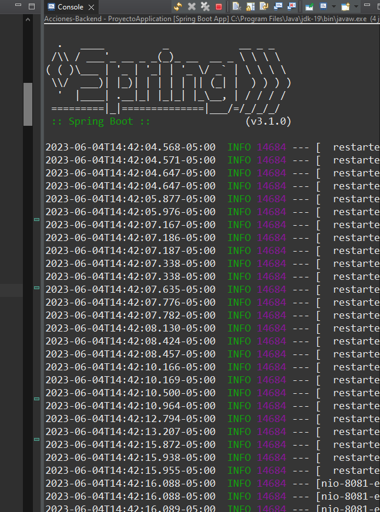
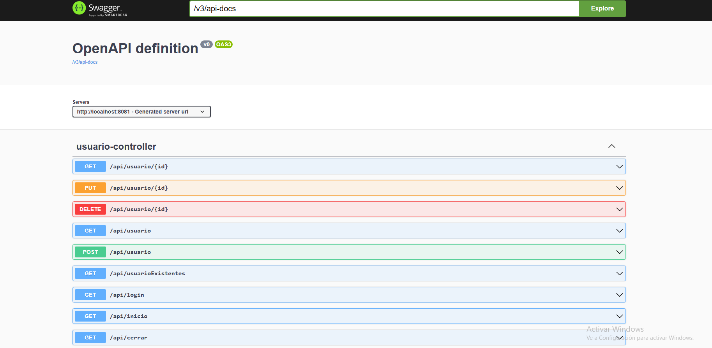
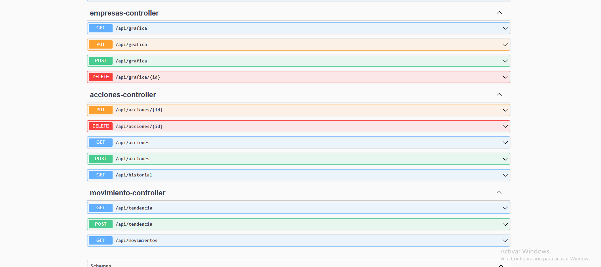
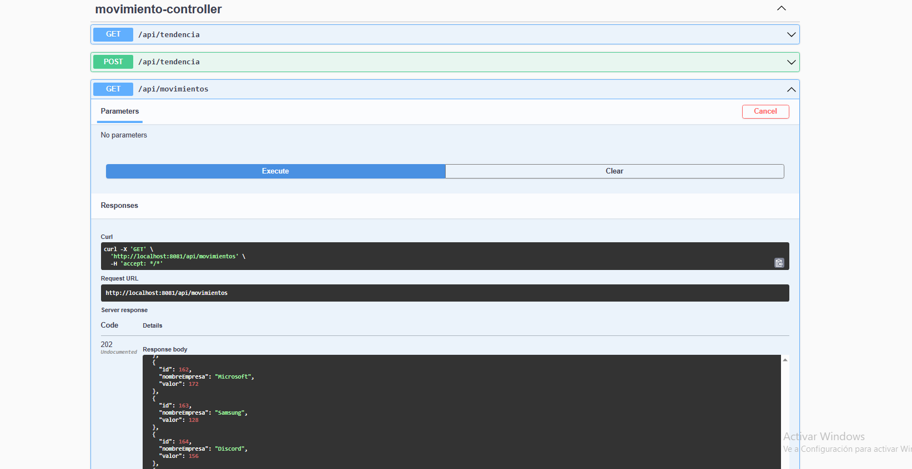

# Acciones-Backend

Este es un proyecto de backend desarrollado con Spring Boot para crear una aplicación web utilizando Java. Se ha diseñado para conectarse con un frontend también desarrollado en Java.

## Requisitos previos

Antes de comenzar a trabajar con este proyecto, asegúrate de tener instalados los siguientes componentes:

- Java Development Kit (JDK) 11 o superior
- Apache Maven
- Spring Boot

## Configuración del proyecto

1. Clona este repositorio en tu máquina local o descarga el código fuente.
2. Abre el proyecto en tu entorno de desarrollo preferido.

## Capturas de Pantalla

    
   
    
    
    
      

## Tecnologías utilizadas

Este proyecto de backend ha sido desarrollado utilizando las siguientes tecnologías:

- Java
- Spring Boot
- MySQL (Base de datos relacional)
- Hibernate (ORM - Mapeo objeto-relacional)
- JUnit (Framework de pruebas unitarias)

## Contacto

Kevin Gonzalez- revkelo
